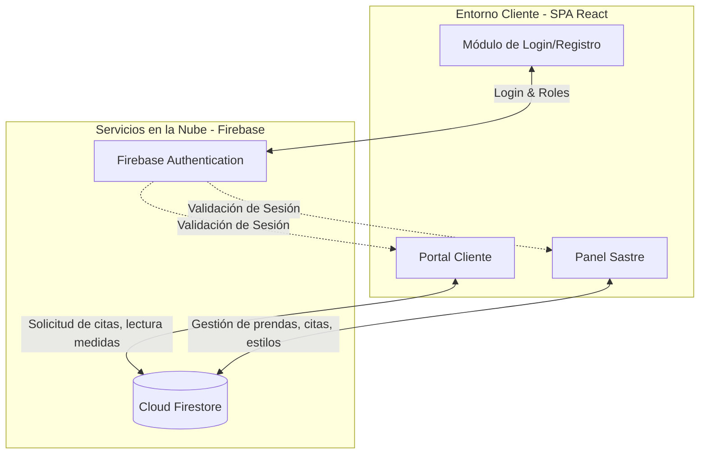

# 🧵 TallerConnect — Plataforma de Gestión Integral para Sastrerías y Clientes

[](https://react.dev/)
[](https://vitejs.dev/)
[](https://tailwindcss.com/)
[](https://firebase.google.com/)

---

**TallerConnect** es una plataforma moderna e intuitiva diseñada para conectar sastrerías con sus clientes de manera eficiente. Facilita la gestión de citas, el seguimiento de prendas en confección, y la administración de medidas personalizadas. Todo sincronizado en la nube para garantizar una comunicación fluida y un servicio de confección de alta calidad.

---

## 🎨 Características Principales

### 👨‍💼 1. Panel de Administración para el Sastre
El núcleo de la aplicación permite al sastre gestionar todo su taller de forma digital:

*   **📅 Calendario de Citas:** Gestión visual de citas con clientes (tomas de medidas, pruebas, entregas) integrado con `react-big-calendar`.
*   **👗 Gestión de Prendas:** Control del estado de las prendas en confección, con actualizaciones en tiempo real sobre su progreso.
*   **✂️ Catálogo de Estilos:** Administración de estilos y diseños para ofrecer opciones claras a los clientes.

### 👤 2. Portal Exclusivo para el Cliente
Una interfaz dedicada para que el cliente tenga control sobre sus encargos:

*   **📏 Mis Medidas:** Visualización detallada del perfil de medidas del cliente, asegurando precisión en futuros trabajos.
*   **📝 Solicitud de Citas:** Formulario integrado para agendar citas directamente con el sastre de forma rápida.
*   **🔔 Notificaciones y Estado:** Seguimiento del progreso de sus prendas y notificaciones importantes sobre su pedido.

---

### ⚡ 3. Experiencia de Usuario y Autenticación
*   **Autenticación Segura:** Sistema de roles (Sastre / Cliente) respaldado por `Firebase Authentication`, asegurando que cada usuario acceda solo a su información.
*   **Interfaz Dinámica:** Componentes interactivos e iconos estilizados de `lucide-react`, con notificaciones en tiempo real vía `react-hot-toast`.

---

## 🛠️ Stack Tecnológico

El proyecto está construido bajo una arquitectura moderna de alto rendimiento:

*   **Vite + React (v19):** Bundling ultrarrápido y renderizado ágil de componentes e interfaces.
*   **Firebase SDK (v12):** Backend-as-a-Service para la base de datos y la autenticación de usuarios.
*   **React Router DOM (v7):** Navegación fluida y rutas protegidas (Client-side routing).
*   **Tailwind CSS:** Diseño responsivo, elegante y minimalista adaptado para herramientas de gestión.
*   **EmailJS:** Integración para envío de correos transaccionales y confirmaciones de citas.

---

## 📐 Arquitectura de Datos y Flujo de Información



---

## 📂 Estructura del Proyecto

A continuación se detalla la organización de directorios y la responsabilidad de cada sección del código fuente:

```bash
TallerConnect/
├── src/
│   ├── components/         # Componentes organizados por dominio
│   │   ├── auth/           # Login, Registro, Rutas Protegidas
│   │   ├── cliente/        # Vistas del cliente (Inicio, MisMedidas, CitaForm)
│   │   ├── sastre/         # Vistas del sastre (Calendario, Prendas, Estilos)
│   │   ├── common/         # Componentes UI reutilizables (Logo, etc.)
│   │   └── layout/         # Estructura principal (Navbar)
│   │
│   ├── context/            # Estados globales (AuthContext)
│   ├── hooks/              # Custom hooks (useCitas, useNotificaciones)
│   ├── types/              # Definiciones de TypeScript
│   ├── utils/              # Funciones auxiliares y constantes
│   ├── firebase/           # Configuración e inicialización de Firebase
│   │
│   ├── App.css / index.css # Estilos base y de Tailwind
│   ├── App.tsx             # Enrutador principal de la aplicación
│   └── main.tsx            # Punto de entrada de React
├── tailwind.config.js      # Configuración de Tailwind
├── vite.config.ts          # Configuración del servidor Vite
└── package.json            # Dependencias del sistema y scripts npm
```

---

## 🚀 Instalación y Configuración Local

Para ejecutar la plataforma localmente, asegúrate de tener instalado [Node.js](https://nodejs.org/).

### 1. Clonar el repositorio y acceder
```bash
git clone https://github.com/franmarysoli/TallerConnect.git
cd TallerConnect
```

### 2. Instalar dependencias
```bash
npm install
```

### 3. Iniciar servidor de desarrollo
```bash
npm run dev
```
Vite abrirá la plataforma en el puerto local por defecto: `http://localhost:5173/`.

---

## ⚡ Configuración de Firebase

Para sincronizar la aplicación con tu propio proyecto de Firebase:

1. Crea un proyecto en la [consola de Firebase](https://console.firebase.google.com/).
2. Añade una **Web App** y copia la variable de configuración.
3. Crea un archivo `.env` en la raíz del proyecto basándote en las credenciales:
   ```env
   VITE_FIREBASE_API_KEY=tu_api_key
   VITE_FIREBASE_AUTH_DOMAIN=tu_auth_domain
   VITE_FIREBASE_PROJECT_ID=tu_project_id
   VITE_FIREBASE_STORAGE_BUCKET=tu_storage_bucket
   VITE_FIREBASE_MESSAGING_SENDER_ID=tu_sender_id
   VITE_FIREBASE_APP_ID=tu_app_id
   ```

---

Desarrollado para optimizar la confección y la relación sastre-cliente. 🧵✨
